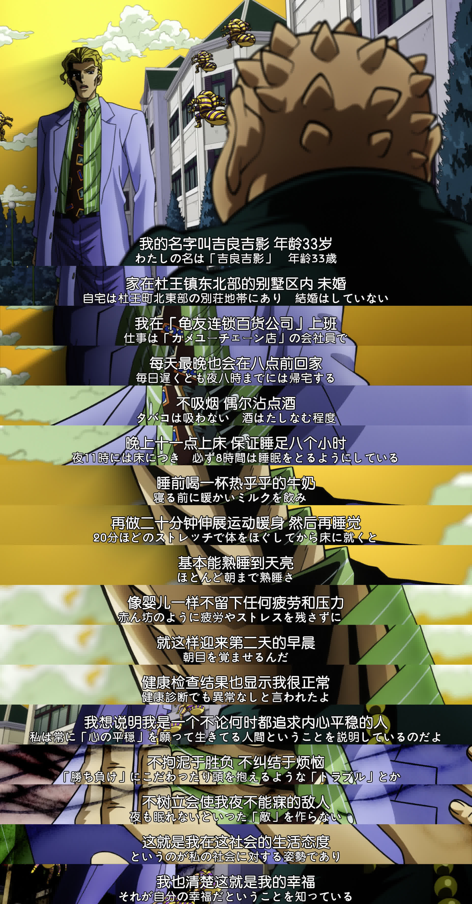

# mpv-lines-meme-generator *for Windows*



This script allows users to take screenshots in MPV, crop them to keep only the bottom portion, and stitch them together into a long vertical image, just like a meme of lines. It is designed for Windows operating systems and requires `ffmpeg` to function.

## Features

- Take multiple screenshots with the press of a key.
- Crop the bottom portion of the screenshots to create a unified long image with customizable location.
- Stitch all cropped images together into a single output image.
- Option to save screenshots in lossless `.png` format for higher quality or `.jpg` format for smaller file size.
- Customizable directory for saving images and height of cropped sections.

## Dependencies

- MPV Media Player
- FFmpeg (**ensure it is in your system's PATH**)

## Installation

1. Ensure you have [MPV](https://mpv.io/) and [FFmpeg](https://ffmpeg.org/) installed on your system.
2. Copy the script into your MPV scripts directory, typically found at:
   - `C:\Users\<YourUsername>\AppData\mpv\scripts\`
3. Edit the script to set the desired screenshot directory, cropping arguments, whether to save images in lossless format and ffmpeg log level.
4. Restart MPV.

## Usage

1. **Key Bindings**:
   - Press **`n`** to take a screenshot (can be pressed multiple times).
   - Press **`Ctrl+n`** to create the stitched image from the taken screenshots.
   - Press **`Alt+Up/Down`** to increase/decrease the **top** margin of the subtitles.
   - Press **`Alt+Left/Right`** to increase/decrease the **bottom** margin of the subtitles.
   - Press **`Alt+m`** to toggle the mouse position ratio display in order to show the position intuitively.

2. **Configuration**:
   - Update the `dir` option in the script to specify the directory where screenshots will be saved.
   - Adjust the `subtitle_top` and `subtitle_bottom` option to set the top/bottom margin of subtitles to keep (height from the bottom).
   - Set the `lossless` option to `true` if you want lossless PNG images, or `false` for compressed JPEG images. 
   - Set the `ffmpeg_loglevel` option to select the appropriate logging level to avoid ffmpeg outputting too many log records. (ffmpeg log level: quiet, panic, fatal, error, warning, info, verbose, debug)

**Note:** Using the **lossless** option will significantly increase the time it takes to process and stitch images due to the larger file size and processing requirements of PNG files.

## Example Configuration

```lua
local options = {
    dir = "C:/Users/YourUsername/Documents/mpv/screenshots",
    subtitle_top = 0.15,  -- Set 15% (of video height) to the top of subtitles
    subtitle_bottom = 0, -- Set the bottom to the bottom of subtitles
    lossless = false,  -- Save screenshots as JPG for lower processing time
    ffmpeg_loglevel = "error",  -- Only output error and fatal logs
}
```

## Acknowledgments

- Original concept and code by [Wanakachi](https://github.com/WatanabeChika).
- Thanks to [Dai-JiaLin](https://github.com/Dai-JiaLin) -- submitted PR #1, which added the ability to freely adjust the cropping height.

## Troubleshooting

- If you encounter issues with the script, ensure that the paths are correctly set and that `ffmpeg` is accessible from the command line.
- Check the MPV log for error messages related to the script.

